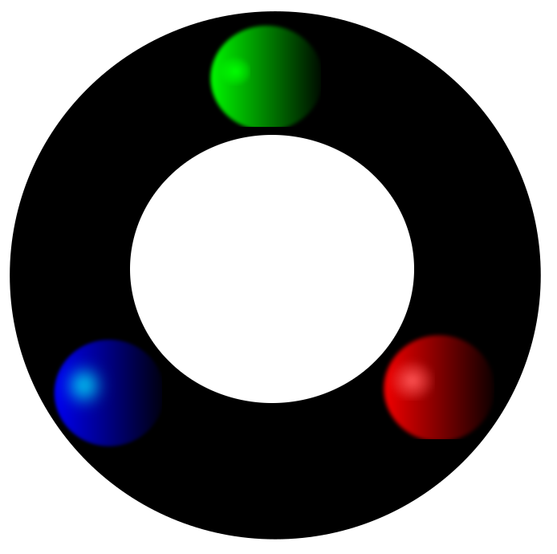

<p align="center">
    
      
</p>

## NeoCompiler Eco

This is an open-source initiative for providing an easy access to on NEO ecosystem.

In particular, we provide simple interact and didactic interfaces for allowing online compiling for C#, Python, Go and Java.


### What does it currently do
* Compile input C#, Python, Go or Java code using reliable and safe servers (backend) compilers;
* Return AVM and ABI codes (more precise of C# compiler);
* Deploy and invoke code to private net (Current in the back);
* Tests with different wallets, synced and with able to provide historic data our activity;
* Perform different types of blockchain invocations and RPC calls.

### Roadmap
* Using websockets to accelerate responses (more fluid)
* Integrate with testnet invokes
* Integrate with `neolink` project (or any other), to allow secure key management for Test/MainNet
* Move towards client-based compiling (more secure, robust and much more scalable).
    - Some efforts have been done here already, but many technical challenges are still being dealt with;
    - It has not been easy, still, to accomplish all necessary invocatations only in the client side. On the other hand, the server has been responding smooth and nice, providing a nice didactic infrastructure to be used by professors, researchers and those intesred on Neo's multi-language programming interface.
* Ideas? Collaborations are welcome :) The goal is to be didactic and bring it close to citizens and users: Smart Cities, Smart Governance and Smart Blockchain Technologies :P

### Dependencies

For Debian-based systems:

Start any recursive submodule: `git submodule update --recursive --remote`

`apt install npm`

`apt install nodejs-legacy`

`npm install`

### Installing docker-compose 1.19.0+

We need docker-compose version 1.19.0 (or more), so we recommend the following steps for installation:

`curl -L https://github.com/docker/compose/releases/download/1.19.0/docker-compose-``uname -s``-``uname -m`` -o` `/usr/local/bin/docker-compose`
`chmod +x /usr/local/bin/docker-compose`
`echo "export PATH=\$PATH:/usr/local/bin/" >> ~/.bashrc`
`source ~/.bashrc`

### Docker recommendations

Docker technology is essential for sandboxing all compilers in different environments (for different languages).

We DO NOT recommend packages docker.io/docker-engine: `sudo apt purge docker docker-engine docker.io`.

* Ubuntu-based distributions (https://docs.docker.com/install/linux/docker-ce/ubuntu/#set-up-the-repository)[guidelines]:

`sudo apt-get install apt-transport-https ca-certificates curl software-properties-common gnupg2`
`curl -fsSL https://download.docker.com/linux/ubuntu/gpg | sudo apt-key add -`
`sudo apt-key fingerprint 0EBFCD88`
`sudo add-apt-repository "deb [arch=amd64] https://download.docker.com/linux/ubuntu $(lsb_release -cs) stable"`
`sudo apt update`
`sudo apt install docker-ce`

* Deepin users can follow Ubuntu instructions and use `artful` (Ubuntu 17.10) repository:
`sudo add-apt-repository "deb [arch=amd64] https://download.docker.com/linux/ubuntu artful stable"`

# Build everything

The online command required to create our own NeoCompiler Ecosystem, suitable for private of public blockchain projects.

This will call a docker-compose with NeoCompiler Private Net (Eco)+NeoScan.
Furthermore, it will set all available compilers and open the front/backend interface and server, respectively.

`./build_everything.sh`

# Developers guidelines

Basically, two steps are required: A1 and A2.
Both are described below.

## A1) Building compilers and running node server

This script already builds the compilers and starts the server:

`./buildCompilers_startWebInterface.sh`

### Building compiling backends (C#, Python, Java and Go)

#### Building docker-neo-mono backend
The backend for C# is provided by mono, only two steps are necessary to build and tag image `docker-mono-neo-compiler`:

`cd docker-neo-mono`

`docker_build.sh`

#### Building docker-neo-boa backend
The backend for Python is provided by neo-boa compiler, only two steps are necessary to build and tag image `docker-neo-boa`:

`cd docker-neo-boa`

`docker_build.sh`

#### Building docker-neo-go backend
The backend for Go is provided by neo-go team, only two steps are necessary to build and tag image `docker-neo-go`:

`cd docker-neo-go`

`docker_build.sh`

#### Building docker-java backend
The backend for Java is provided by neoj compiler (in mono), only two steps are necessary to build and tag image `docker-neo-java-compiler`:

`cd docker-java`

`docker_build.sh`


### Running node server

After building the compilers (without privatenet) you can run the front/backend node server (at port 8000 by default):

`./run.sh`

## A2) Eco Network Funtionalities

In order to add NeoScan `light wallet` functionalities, docker-compose is the main tools that acts for the creation of our micro-service .

This script will start all necessary backend functionalities, neo-csharp-nodes, neo-python and neo-scan.

In particular, we currently have:

* csharp nodes are with TCP at 2033x and RPC at 3033X, websocket is not being used
  * 4 csharp consensus node, one of then is also a RPC at port 30333
  * 2 csharp pure RPC nodes, 30337 and 30338
  * Thus, in summary, 3 csharp RPC nodes.
* 7 python containers
  * 4 wallets pre-synced
  * 1 python REST api at 8080
  * 1 python RPC api 10032
  * 1 python for creating the genesis block and performing a first transaction
* postgress container with a pre-compiled neo-scan image for fast startup  

### Dealing with docker-compose swarm of containers

Start up the container, checking the messages and following warnings

`cd ./docker-compose-eco-network`

```
docker-compose up
```

Start up the container in a detached mode
```
docker-compose up -d
```

Feel free to take is down
```
docker-compose down
```

However, consider stopping and restarting
```
docker-compose stop
docker-compose start
```

### NeoCompiler Eco useful commands and ideas

#### Other functionalities and integrations are possible and some are implemented

It is also possible to integrate the Eco Network with Neondb and NeoTracker.

#### Other parameters

One could check docker docker-compose.yml, picking up a combination of your choice from `docker-compose-eco-network` folder.
This can be done for locally modifying some characteristic of NeoCompiler.

Run `build_everything.sh` with an additional parameter `--no-build` and your modified files of the private net will be called.


#### Useful Commands

# Open docker of python
`docker exec -it eco-neo-python-first-multisig-transfer-running bash
`

`screen -ls`

# open csharpnodes

`docker exec -it eco-neo-csharp-nodes-running bash`
`screen -ls` will show 4 consensus nodes and 2 pure RPCs nodes.


## Contributing

* If you have ideas or issues, you can inform directly at github or contact us directly

  1. Check the open [issues](https://github.com/NeoResearch/neocompiler-eco/issues) and
[pull requests](https://github.com/NeoResearch/neocompiler-eco/pulls) for existing discussions.
  1. Open an issue first, to discuss a new feature or enhancement.
  1. Write tests, and make sure the test suite passes locally and on CI.
  1. Open a pull request, and reference the relevant issue(s).
  1. After receiving feedback, squash your commits and add a great commit message.
  1. Run `make push-tag` after merging your pull request.
  1. Anyway, you already were part of team... :P

* Our team is currently formed by researchers/professors, so our time is very constrained... if you feel you can help us, don't hesitate!
* We created a wallet specially for project donations. That can help us improve our servers and perhaps hire someone for improving graphical interfaces and developing many more interesting features. NEO wallet:
__AJX1jGfj3qPBbpAKjY527nPbnrnvSx9nCg__


**LICENSE MIT**

This project is part of NeoResearch initiative and it is freely available at [NeoCompiler.io](https://neocompiler.io).
The website is rebooted periodically, in order to keep resource usage low, so that everyone is welcome to use it.

*NeoCompiler Eco team* [@igormcoelho](https://github.com/igormcoelho),[@vncoelho](https://github.com/vncoelho) and [@FabioRick](https://github.com/FabioRick)

Copyleft 2017-2018
